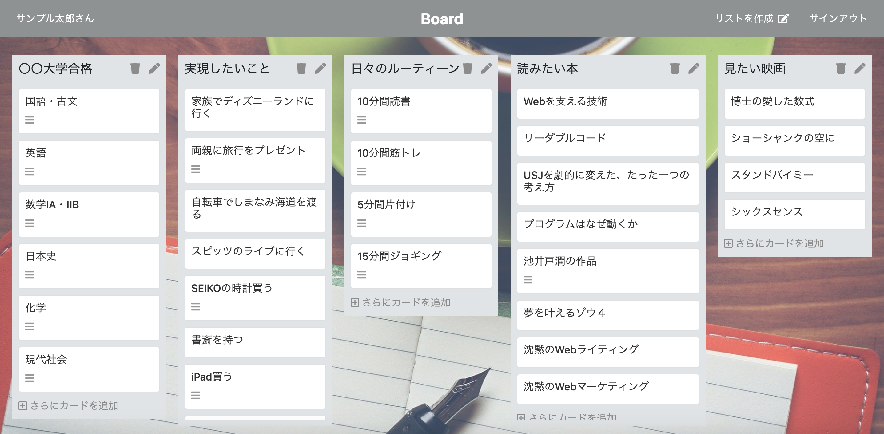

# 【個人制作アプリ Board】

## 【アプリケーションの作成理由】
1. <b>タスクや思考を整理するアプリが欲しい</b>   
  マンダラートという思考を整理するフレームワークがありますが、項目が少なくても多くても使いにくい時があります。 
  人生は一度きり。時間も戻って来ません。だからしないといけないことや、したいと思ったこと、少しでも興味を持ったことなどを忘れないようにメモしておくTODOアプリが欲しいと思い、作成しました。今日では、多くのメモ機能や思考を整理するツールがあります。それは便利な反面、どこにメモしたか、わからなくなることがあります。 
  そのため、このアプリでは大分類、小分類、その詳細を入力でき、なるべくこのアプリ一つで、様々な分野の思考を整理することが出来るようにしました。
  目標はなんでも構いません。使い方は簡単で、リストに実現したいことを入力し、その下に小分類したカードを作成し、それを一つ一つ実行に移すことによって前進し、成長や満足感・充実感を感じることが出来ます。 

## 【ペルソナ、ターゲットユーザー】
使用用途は多種多様で、人それぞれ各々の課題に対して使うことが出来ます。受験や資格試験、仕事、ダイエット、人生の充実、などどのような目標設定でも設定可能です。 
そのため、人生を充実させたい人や使用可能ですが、主なターゲットユーザーは、<b>何か目標に向かって頑張る人全員</b>です。

## 【このアプリで実現できること】
  - 個人のタスク管理目的や課題に対する手段が明確になります。 
  - 目標が具体的でも抽象的でも設定可能 
  - やるべきことが明確化 
  - したいこと、しないといけないことを忘れない 
  - 段取りの整理 
  - 人生の目的を見失わず、幸福度が上がる 
  - 派生して新たな目標などが出来、ワクワクする 

## 【実装済機能一覧】
1. ユーザー登録およびログイン機能(devise) 
  ユーザー登録機能があり、ユーザー各々のリストとカードを作成できる。 
2. ログイン機能(devise) 
  メールアドレス、パスワードの入力でログインでき、ログインユーザーのみ利用可能 
3. リストとカードの一覧表示、カードの詳細表示 
  リストとカードの一覧表示、カード毎の詳細情報 
4. リスト・カードの編集・削除機能
  リスト・カード作成後の編集および削除が可能。 
5. FontAwesomeの使用 
  作成・編集・削除のボタンにアイコンを使用しが視覚的・直感的にわかるように実装 
6. 全て著作権フリーの画像を使用 
  権利関係で何も問題ないようにするため 

## 【この先実装したい機能】
 - JavaScript(React)を用いてリスト間のカード移動ができるように 
 - タスク完了時のチェック機能

## 【参考ページ紹介動画】
トップページ（ログイン時）  https://gyazo.com/9e08032f84b2ce335cb2c857b145f0ec 

### 【連絡先】
久田智大 ヒサダトモヒロ 
Gmail / dekirumadeyamenai@gmail.com 
twitter / https://twitter.com/tomotech5 