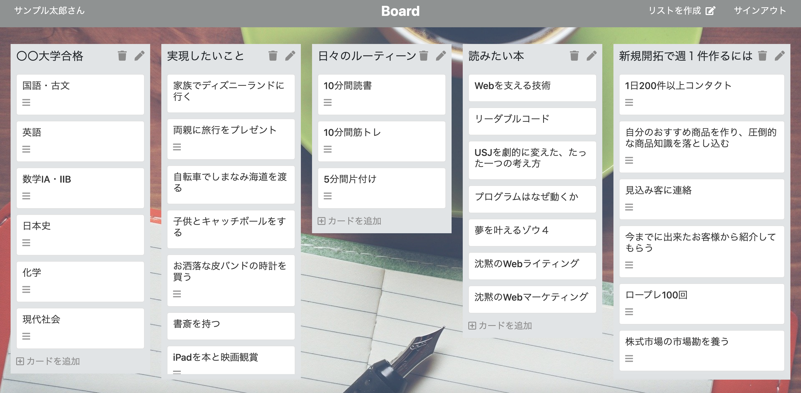

# 【個人制作アプリ Board】
<table>
<tr>
<td></td>
<td></td>
</tr>
<tr>
<td></td>
<td></td>
</tr>
</table>

## 【アプリケーションの作成理由】
 <b>「タスクや思考を整理するアプリが欲しい」</b>    
  &emsp;人生は一度きり。時間も戻って来ません。だから「しないといけないことや」「したいと思ったこと」「少しでも興味を持ったこと」などを忘れないようにメモしておくTODOアプリが欲しいと思い、作成しました。 
  &emsp;今日では、多くのメモ機能や思考を整理するツールがあります。それは便利な一方、ツールを分け過ぎてどこにメモしたか、探すのが面倒になることがあります。そのためこのアプリでは一元管理できるように、大分類、小分類、その詳細を入力でき、なるべくこのアプリ一つで様々な分野のことを書き込めるようにしています。 
  &emsp;目標はなんでも構いません。使い方は簡単で、リストに実現したいことを入力し、その下に小分類したカードを作成し、それを実行するだけです。一つ一つ実行に移すことによって前進し、成長や満足感・充実感を感じることが出来ると考えています。 

## 【ペルソナ、ターゲットユーザー】
<b>メインターゲット：18〜40代前半の社会人の方々</b> 
&emsp;このアプリは、単なるTODO管理だけでなく、目標や課題があれば何にでも使うことが出来ます。例えば、受験や資格試験、仕事、筋トレにダイエットなどの目標を設定し、その実現に必要なタスクや要素をカードに記入することによって、道筋を整理したり、何をする必要があるのか把握できます。また、「死ぬまでにしたいこと100」「見たい映画100」といったことを設定すれば、それを一つ一つ実行に移すことで充実感に満ちて幸福度が上がります。 
&emsp;そのため、<b>何か目標に向かって頑張っている人や様々なことにチャレンジして人生を充実させたい人全員</b>に価値を提供できると考えております。しかし、メモや手帳に書くことに慣れている世代の方々と、行動の幅が限定的な中学生以下の人々には浸透しないと考えているため、メインターゲットユーザーは、<b>18〜40代前半の社会人の方々</b>を対象に考えております。

## 【このアプリで実現できること】
  - 様々な分野のタスクが一元管理でき、したいこと、しないといけないことが明確になり整理できる。 
  - 目標が具体的でも抽象的でも設定可能。 
  - 実現したいことを見失わず、一つ一つ実行に移すことで充実感を得られる。派生して新たな目標などが見つかりワクワクすることも。 

## 【実装済機能一覧】
1. ユーザー登録およびログイン機能(devise) 
  ユーザー登録機能があり、ユーザー各々のリストとカードを作成できる。 
2. ログイン機能(devise) 
  メールアドレス、パスワードの入力でログインでき、ログインユーザーのみ利用可能 
3. リストとカードの一覧表示、カードの詳細表示 
  リストとカードを一覧表示し、クリックするとカードの詳細情報を表示。 
4. リスト・カードの編集・削除機能 
  リスト・カード作成後の編集および削除が可能。 
5. FontAwesomeの使用 
  作成・編集・削除のボタンにアイコンを使用しが視覚的・直感的にわかるように実装。 
6. 全て著作権フリーの画像を使用 
  権利関係で問題ないようにするため。 

## 【この先実装したい機能】
 - JavaScript(React)を用いてドラッグするとカードが移動ができ、順番を入れ替えたり出来る機能の実装 
 - タスク完了時のチェック機能の実装

## 【参考ページ紹介動画】
トップページ（ログイン時）  https://gyazo.com/9e08032f84b2ce335cb2c857b145f0ec 

### 【連絡先】
久田智大 ヒサダトモヒロ 
Gmail / dekirumadeyamenai@gmail.com 
twitter / https://twitter.com/tomotech5 